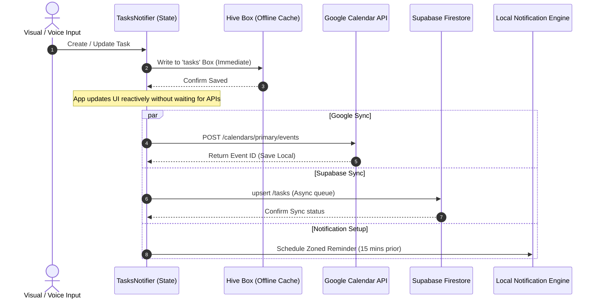

# ⚡ QuickTask — Premium Voice-Driven Task Manager

A stunning, ultra-premium, production-grade Flutter task manager utilizing natural language processing (NLP) to parse tasks directly from your voice. Featuring real-time Google Calendar synchronization, offline-first local storage cache, and native multi-lingual support (English, Arabic, French, German).

Designed with a high-fidelity, glassmorphic **Midnight Dark Theme** featuring responsive HSL neon accents, micro-animations, and tactile haptic feedback.

---

## ✨ Core Highlights & Features

### 🎙️ AI-Powered Voice Parsing (NLP)
* **Real-time Speech Recognition**: Enabled via `speech_to_text`, allowing hand-free creation of tasks.
* **Smart Natural Language Parser**: A custom regex-based NLP engine (`TaskParserService`) automatically extracts titles, dates, and times from phrases (e.g., *"at 10 PM tomorrow"* or *"الساعة 10 مساءً غداً"*).
* **Text-to-Speech (TTS)**: Voice prompt instructions and confirmations in multiple languages via `flutter_tts`.

### 📅 Bidirectional Google Calendar Sync
* **Calendar API Integration**: Links with the Google Calendar API using secure OAuth credentials via `google_sign_in` and `googleapis`.
* **Automatic Provisioning**: Automatically creates Google Calendar events upon task creation, shifts dates, and deletes events if a task is removed.
* **Sync Indicators**: Interactive top-bar calendar sync pill with a pulsing mint neon heartbeat dot to verify connectivity.

### 📦 Offline-First & Supabase Cloud State Sync
* **Tiered Write Strategy**: All actions write to local Hive storage immediately (zero lag), followed by asynchronous best-effort writes to Supabase DB.
* **Graceful Degradation**: Offline actions cache locally and synchronize transparently with Supabase when internet connectivity is restored.
* **Supabase Authentication**: Secure login, registration, and Google OAuth flow managed with `supabase_flutter`.

### 🌐 Native Multi-lingual & RTL Support
* **Four Main Languages**: Full translations for English (`en`), Arabic (`ar`), French (`fr`), and German (`de`).
* **First-Class RTL Support**: Automated UI mirror-flipping and text alignment optimizations when the Arabic locale is selected.
* **Locale Fast-Switching**: Dual language long-press triggers directly on the interactive floating microphone controller.

### 🎨 Visual Identity & Premium Bento Grid UI
* **Pure Dark Scaffold**: An immersive true-black `#000000` base background.
* **Plus Jakarta Sans Typography**: Tailored typography relying on `FontWeight.w200` (ExtraLight) and `FontWeight.w300` (Light) for a clean, futuristic, lightweight look.
* **Bento Grid layout**: Interactive status gauges, customizable category grids, collapsible advanced settings, and progressive disclosure flow.
* **Glassmorphism Overlay**: Frosted glass panels built using `BackdropFilter` (sigma 12) framed by sleek 1.5px semi-transparent borders.

---

## 🎨 Design System & Visual Identity

### Color Tokens (`lib/core/constants/app_colors.dart`)

| Token | Hex | Representation | Primary Application |
| :--- | :--- | :--- | :--- |
| `background` | `#000000` | ⬛ Pure Black | Scaffold background |
| `cardBg` | `#0C0C0C` | ⬛ Near Black | Container cards, floating navigation |
| `innerCard` | `#1E1E1E` | ⬜ Dark Gray | Nested panels, collapsible settings |
| `mint` | `#B8F0C8` | 🟢 Mint Neon | Primary accent, completed status, "Today" stats |
| `purple` | `#D4BFFF` | 🟣 Pastel Violet | Secondary actions, "Work" category indicator |
| `yellow` | `#F5EFA0` | 🟡 Neon Yellow | Highlights, "Study" category, warnings |
| `orange` | `#FFC58D` | 🟠 Neon Orange | "Family" category indicator, reminder options |
| `pink` | `#FF94E8` | 💗 Neon Pink | "Shopping" category tags |
| `textPrimary` | `#FFFFFF` | ⬜ Solid White | Headers and primary text |
| `textSecondary`| `#A0A0A0` | 🩶 Medium Gray | Subtitles, labels, and helper prompts |
| `textHint` | `#606060` | 🩶 Charcoal | Placeholders, inactive fields |
| `divider` | `#2A2A2A` | 🟫 Dark Gray | Micro borders, divider lines, bounds |
| `error` | `#FF6B6B` | 🔴 Soft Coral | Alerts, overdue indicators, "Health" tag |

### Typography Tokens (`lib/main.dart`)
* **Font Family**: `Plus Jakarta Sans` (linked via `google_fonts`)
* **Display Weights**: `w200` (ExtraLight) — configured for Display Large, Medium, Small, and all Body text.
* **Interface Weights**: `w300` (Light) — configured for titles, subtitles, buttons, and navigation badges.
* **Special Highlights**: `w700` and `w800` strictly reserved for main greetings and category titles to maintain extreme visual contrast.

---

## 🏗️ Architecture & Codebase Structure

QuickTask employs a **Hybrid Feature-First & Layered Architecture** inspired by Clean Architecture. This structure guarantees a decoupling of business logic from framework bindings.

```
quicktask/
├── android/                   # Native Android wrapper & configuration
├── ios/                       # Native iOS wrapper & provisioning
├── assets/                    # Static branding and graphics
├── lib/
│   ├── main.dart              # Global app bootstrap & theme specifications
│   │
│   ├── core/                  # Core cross-cutting infrastructure
│   │   ├── constants/
│   │   │   └── app_colors.dart # Global design system tokens and color maps
│   │   ├── database/
│   │   │   ├── database_service.dart  # Hive box initialization & static CRUD helpers
│   │   │   └── task_model_hive.dart   # Local cached task model (Hive adapter)
│   │   ├── localization/
│   │   │   ├── app_localizations.dart # Multi-lingual resource manager
│   │   │   ├── locale_provider.dart   # Reactive locale modifier provider
│   │   │   └── translations/          # Translation tables (ar, de, en, fr)
│   │   └── router/
│   │       └── app_router.dart        # GoRouter routes with reactive Auth guards
│   │
│   ├── domain/                # Enterprise & business logical models
│   │   ├── entities/
│   │   │   └── task_entity.dart       # Pure Dart Task entity
│   │   └── models/
│   │       └── subtask.dart           # Sub-checklist unit definition
│   │
│   ├── data/                  # DB data mappings and repository adapters
│   │   ├── models/
│   │   │   └── task_model.dart        # Supabase mappings and JSON converters
│   │   └── repositories/
│   │       ├── local_task_repository.dart    # Raw Hive DB operations
│   │       └── supabase_task_repository.dart # Remote Supabase API connector
│   │
│   ├── features/              # Feature modular design (Clean Architecture)
│   │   └── auth/                  # Independent authentication sub-system
│   │       ├── domain/            # Auth abstract models and repository definitions
│   │       ├── data/              # Supabase datasource integration & implementations
│   │       └── presentation/      # Premium glassmorphic registration & login forms
│   │
│   ├── presentation/          # Front-end UI Components and controllers
│   │   ├── providers/
│   │   │   ├── task_provider.dart          # Main task state orchestrator (ChangeNotifier)
│   │   │   └── current_task_provider.dart   # Pinboard & current active task provider
│   │   ├── screens/
│   │   │   ├── home_screen.dart            # Main dashboard: glass floating header, progress arcs
│   │   │   ├── add_task_screen.dart        # Step-based progressive task creation flow (v4 UX)
│   │   │   ├── task_detail_screen.dart     # Focus view with subtask checklist managers
│   │   │   ├── summary_screen.dart         # Historical review and completions analytics
│   │   │   └── profile_screen.dart         # User parameters, themes, and accounts portal
│   │   └── widgets/
│   │       └── task_card.dart              # Interactive glassmorphic swipeable card widget
│   │
│   └── services/              # External integrations & API bridges
│       ├── voice_service.dart              # Speech-to-Text & Text-to-Speech manager
│       ├── task_parser_service.dart        # Regular expression natural language parser
│       ├── calendar_service.dart           # REST client wrapper for Google Calendar API
│       └── notification_service.dart       # Local scheduled notification system
```

---

## 🔄 Dynamic Lifecycle Sync Strategy



---

## 📦 Dependencies

The application relies on these core dependencies to provide its seamless productivity features:

| Dependency | Purpose | Details |
| :--- | :--- | :--- |
| `supabase_flutter` | Remote Backend | Handles database persistence, user registration, and authentication hooks. |
| `hive_flutter` | Offline Database | Super-fast local key-value storage used to support offline-first interaction. |
| `google_sign_in` | OAuth Handshake | Obtains user validation and Google Calendar REST API authorization scopes. |
| `googleapis` | Google Calendar API | Programmatically schedules, updates, and deletes events directly on the user's primary calendar. |
| `speech_to_text` | Voice Recognition | High-accuracy device-level voice transcription. |
| `flutter_tts` | Vocal Affirmations | Vocalizes actions and guidelines in French, German, Arabic, or English. |
| `flutter_local_notifications` | Push Notifications | Schedules local notification hooks to trigger due dates. |
| `timezone` | Zoned Scheduling | Aligns scheduled push notifications with localized timezone settings. |
| `go_router` | Declarative Routing | Directs app page movement with native navigation guard locks based on authentication states. |
| `google_fonts` | Typography | Imports the signature `Plus Jakarta Sans` family dynamically. |

---

## 🚀 Installation & Local Environment Setup

### 1. Prerequisites
* **Flutter SDK**: `^3.38.4` (Dart `^3.10.3`)
* **Google Cloud Console Account** (for Google Sign-In and Google Calendar API)
* **Supabase Project**

### 2. Google API Console Provisioning
To enable Google Calendar syncing, create a project on the [Google Cloud Console](https://console.cloud.google.com):
1. **Enable APIs**: Add the **Google Calendar API** to your project.
2. **OAuth Consent Screen**:
   * Configure the Consent Screen and add the `/auth/calendar` scope.
3. **Credentials**:
   * Generate an **Android Client ID** (SHA-1 fingerprint required).
   * Generate an **iOS Client ID**.
   * Copy both client IDs and map them inside the `google_sign_in` implementation under `features/auth`.

### 3. Supabase Environment Configuration
1. Initialize a new project in the [Supabase Dashboard](https://supabase.com).
2. Run the database migration script to generate the `tasks` schema:
   ```sql
   create table public.tasks (
     id uuid primary key,
     user_id uuid references auth.users not null,
     title text not null,
     description text,
     scheduled_at timestamp with time zone not null,
     is_synced_to_calendar boolean default false,
     calendar_event_id text,
     created_at timestamp with time zone default timezone('utc'::text, now()) not null,
     is_completed boolean default false,
     categories text[] default '{}'::text[]
   );
   ```
3. Copy your project's **Supabase URL** and **Anon Key** and verify they match the parameters initialized in `lib/main.dart`:
   ```dart
   await Supabase.initialize(
     url: 'YOUR_SUPABASE_URL',
     anonKey: 'YOUR_ANON_KEY',
   );
   ```

### 4. Codebase Setup and Execution
Clone the repository:
```bash
git clone https://github.com/your-username/quicktask.git
cd quicktask
```

Install Flutter dependencies:
```bash
flutter pub get
```

Generate Hive adapter files:
```bash
flutter pub run build_runner build --delete-conflicting-outputs
```

Execute on your target platform:
```bash
flutter run
```

---

## 🤖 Global Style System Customization (For AI Assistants)

> [!TIP]
> If you are working with an AI assistant to modify the branding, color tokens, or default typography of this app, copy and provide the prompt template below to fast-track changes.

### AI Re-Branding Prompt Template

```
I have a premium Flutter productivity app called QuickTask utilizing a custom design system. 
I want to completely update the global visual theme. Here is our design token configuration:

1. Styling Constants: [lib/core/constants/app_colors.dart]
2. App Theme Configuration: [lib/main.dart]

Please update the theme definitions according to the guidelines below:
- Establish a curated color palette (e.g., Warm Sunset, Cyberpunk Neon, Minimal Forest, Midnight Royal).
- Avoid generic colors. Set harmonious HSL-based accents for colors like mint, purple, yellow, orange, and pink.
- Keep the pure dark background (AppColors.background = #000000) or specify a unified alternative.
- Retain the w200/w300 lightweight Plus Jakarta Sans typography structure to preserve the premium futuristic vibe.
- Ensure that semantic colors like error, success, and warning remain distinct for accessibility.
- Update both raw hex constants in app_colors.dart and any associated hardcoded indicators.

Give me the complete updated lib/core/constants/app_colors.dart code and the step-by-step diff files.
```

---

## 📄 License & Ownership
Copyright © 2026 QuickTask. Distributed under the **MIT License**.
